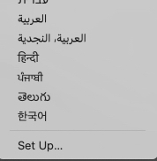
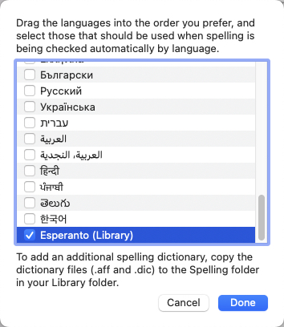
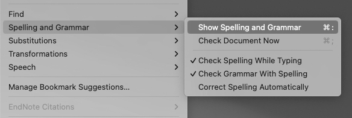
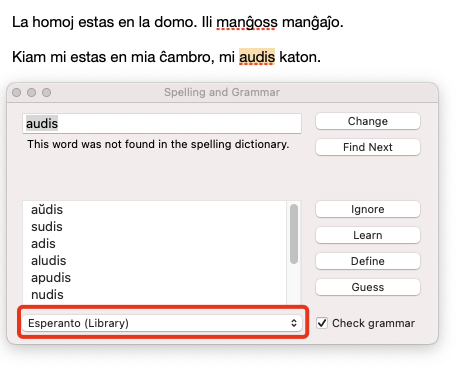
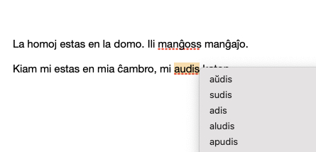

# EsperantoSpellcheckMacOS
How to configure a global Esperanto spellchecker for macOS

### Setup

1) Download both the `.dic` and `.aff` [dictionary files](https://github.com/nhershy/EsperantoSpellcheckMacOS/tree/main/dictionary_files)

2) Copy the dictionary files to the `~/Library/Spelling` folder. (The `Library` folder is a hidden folder. To get to Home/Library, you hold down the Option key while doing Finder > Go)

3) Go to System Settings -> Keyboard -> Clicking on "Edit" in Input Sources -> Spelling, at the bottom it shows "Set Up..."

    

4) `Esperanto (Library)` will now appear as an option. Click the checkbox to enable it. Esperanto spellcheck is now configured on macOS.

    

### How to Use

1) Open up Pages and create a new document

2) Click Edit -> Spelling and Grammar -> Show Spelling and Grammar

    

4) Ensure that `Esperanto (Library)` is selected as the active spelling language

    

5) Spellchecking in Esperanto is now active in Pages

    

### Resources

Dictionary files downloaded from [OpenOffice](https://extensions.openoffice.org/en/project/esperantilo-spell-check-grammar-checker-and-thesaurus-esperanto-language) (v0.4.0992 used)

Tutorials used:
https://discussions.apple.com/docs/DOC-250005161

https://jiradett.medium.com/add-new-language-to-mac-spell-check-ae7f2a7480fd

### Are you looking for an Esperanto Keyboard for macOS? 

Check out [EsperantaKlavaroMacOS](https://github.com/nhershy/EsperantaKlavaroMacOS)!
